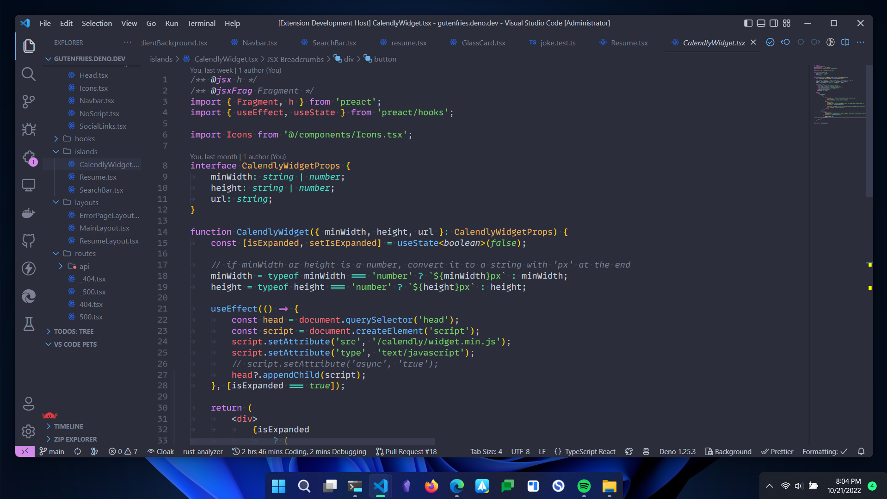
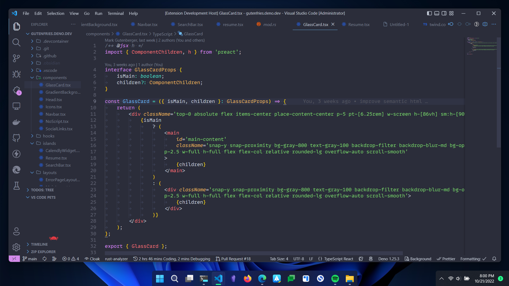
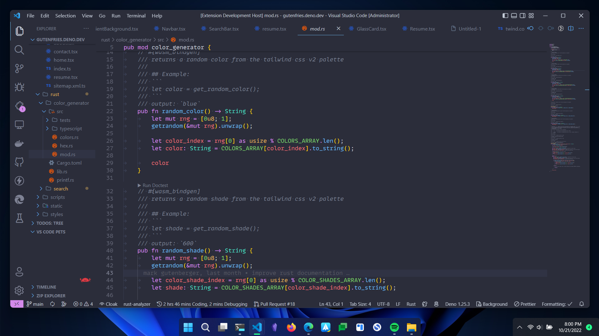
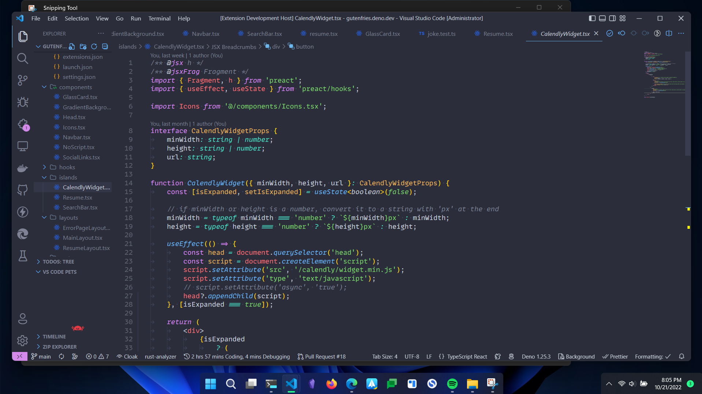
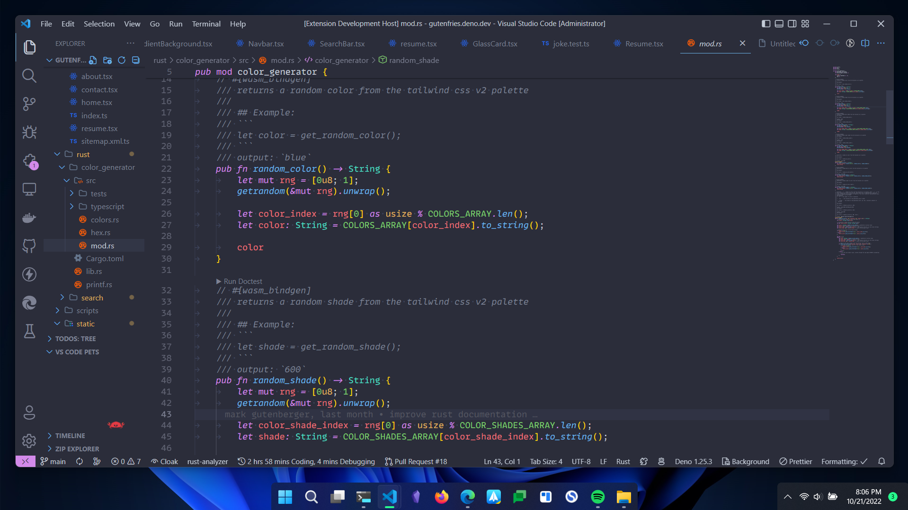
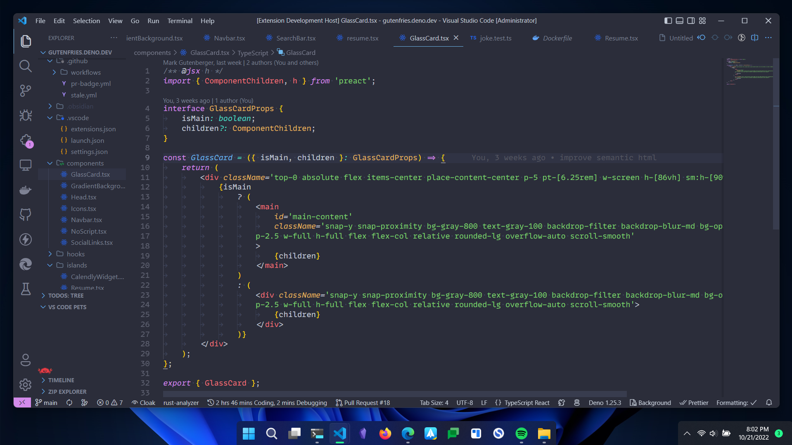

# 10x Dark Theme

> A dark theme for Visual Studio Code

This is a collection of 10x themes for Visual Studio Code. The themes are based on what I find to be the best balance between readability and aesthetics.

If you use them they will make you a 10x developer.

> **\*\*\* 10x developer** _is a subjective term and results are considered subjective. Not legally responsible for productivity level after installing this IDE theme..._

## Installation

1. Open the Extensions sidebar in VS Code. `View → Extensions`
2. Search for `10x Themes`
3. Click `Install`
4. Code > Preferences > Color Theme > 10x Themes. Alternatively, press `Ctrl+K Ctrl+T` and type `10x Themes`

## Screenshots

### 10x Dark

#### TSX

#### More TSX

#### Rust

### 10x Dark Italic

#### TSX

#### More TSX

#### Rust

## Inspiration

I love coding, but as we all know, your code is only as good as your IDE theme. I used [One Dark Pro](https://marketplace.visualstudio.com/items?itemName=zhuangtongfa.Material-theme) for a long time, but it felt a little dull, and I didn't like how my IDE theme was basic (called you out). I wanted something a little more vibrant, but still easy on the eyes. I also wanted something a little more unique, so I decided to make my own. I am also colorblind, and as anyone with visual impairment knows, all high-contrast themes suck because accessibility isn't real. My particular colorblindness affects my distinction between greens-blues-and purples [More information about "Anomalous Trichromats Tritanomaly"](https://www.testingcolorvision.com/what-is-colorblindness.php) (Real Words), so disclaimer, I do not claim to have made a high-contrast theme.

I'll probably add an image with the color palette and brief explanations of color choices later.

## Thank You For Checking out this theme!

If you like this theme, please consider giving it a star on [GitHub](https://github.com/gutenfries/10x-dark-theme) or giving it a rating on [Visual Studio Marketplace](https://marketplace.visualstudio.com/items?itemName=gutenfries.10x-dark-theme).
